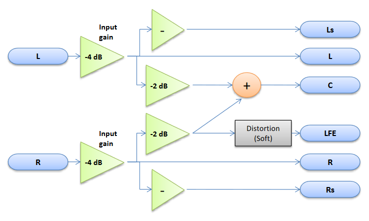

# AADSP2-Project
 Predmetni projekat iz predmeta Arhitekture i Algoritmi DSP-a 2

Zadatak je napraviti sistem sa slike u razvojnom okruzenju Cirrus Logic IDE za audio DSP procesor.

| Control         | Values                        | Default value |
| --------------- | ----------------------------- | ------------- |
| **Enable**      | On/Off                        | On            |
| **Gain**        | From 0 to -inf dB             | -4 dB         |
| **Output mode** | 2_2_0 / 2_2_1 / 3_2_0 / 3_2_1 | 2_2_0         |